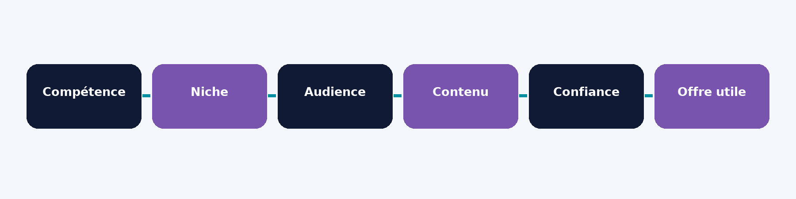
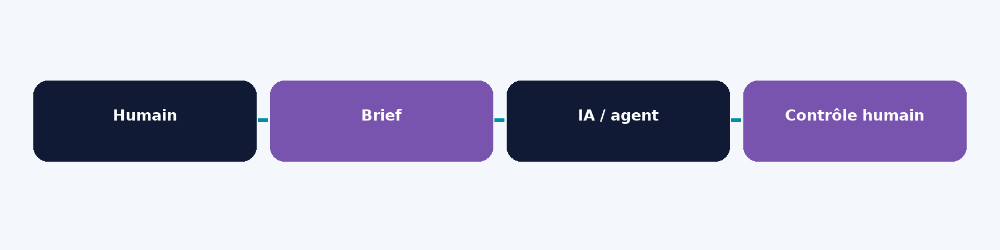
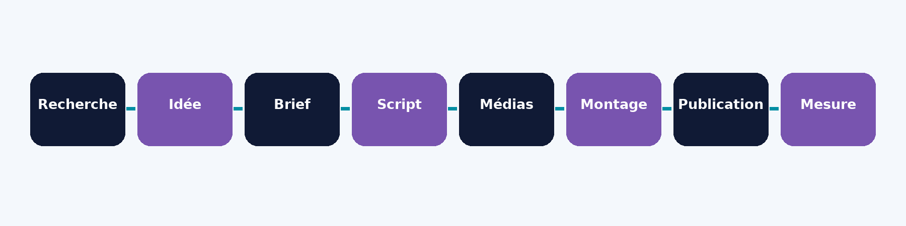
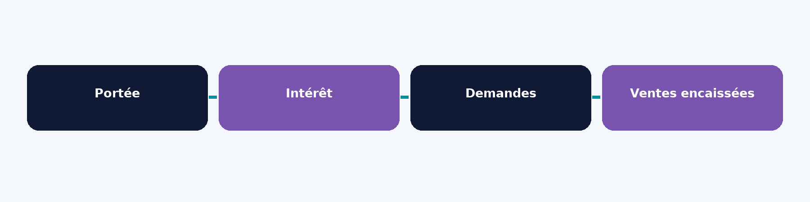

PAGE DE TITRE

BELIVE MONEY — SYSTÈME CRÉATEUR IA

Créer du contenu, utiliser l’intelligence artificielle, structurer son workflow et transformer une audience TikTok en opportunités économiques

Auteur : Valdes Marco BAWA · Édition indépendante de lecture · 2026 · ISBN non attribué

---

# Copyright et avertissement

© 2026 Valdes Marco BAWA. Tous droits réservés, sous réserve des droits applicables et des licences attachées aux contenus tiers. Édition indépendante de lecture, 2026. Aucun ISBN attribué. Ce livre a été préparé avec une assistance IA à partir du texte fourni par l’auteur dans la conversation. La protection juridique des textes assistés par IA dépend du droit applicable. Ce guide est pédagogique, non un conseil juridique, fiscal ou financier personnalisé. Il ne garantit ni revenu, ni viralité, ni accès à la monétisation. Les conditions, pays, tarifs et programmes peuvent changer : consultez la page officielle et le tableau de bord de votre compte avant d’agir. L’auteur demeure responsable de la validation de ses données personnelles, des faits et des droits avant diffusion commerciale.

---

# Dédicace

À la jeunesse africaine, et à toutes celles et ceux qui transforment leur savoir, leur expérience et leurs compétences en valeur utile — sans renoncer à leur liberté.

---

# Remerciements

Je remercie toutes les personnes qui m’ont aidé à apprendre par leurs enseignements, leurs questions et leurs expériences. Je pense à celles et ceux qui entreprennent, doutent, recommencent et partagent des solutions concrètes. Merci aussi à toi, lectrice ou lecteur, pour le temps et la confiance accordés à ces pages. Puisse ce guide t’aider à reconnaître la valeur de ce que tu sais déjà et à la structurer en quelque chose d’utile.

---

# Préface

Je crois que la liberté ne se résume pas à accumuler de la richesse. Elle se construit aussi en apprenant quoi donner, à qui, et comment structurer son savoir, son temps et ses ressources pour créer de la valeur. Je ne propose pas de raccourci vers la viralité ni de garantie de revenu. Je propose une méthode de travail : partir d’une compétence ou d’une idée, comprendre les personnes à qui elle peut servir, publier, écouter les retours et améliorer progressivement une offre que l’on peut réellement livrer. L’IA peut accélérer certaines tâches ; elle ne remplace ni la connaissance du terrain, ni le jugement, ni la relation avec les personnes que l’on souhaite servir.

---

# À propos de l’auteur

Selon la présentation personnelle communiquée dans le manuscrit, Valdes Marco BAWA est entrepreneur digital et technicien supérieur en génie mécanique et productique. Il s’intéresse aux nouvelles technologies, aux systèmes concrets et à l’autonomie. Il indique avoir construit des activités en ligne générant des revenus et avoir créé les boutiques PrimeMarket, Ecom Liberty et Sexualité & Santé ++ ainsi que BELIVE MONEY. Ces déclarations biographiques n’ont pas fait l’objet d’une vérification indépendante ; elles sont à confirmer par l’auteur avant publication.

---

# Introduction

Un téléphone, une idée et une connexion peuvent suffire pour commencer à publier. Ils ne suffisent pas, à eux seuls, à bâtir une entreprise. Le parcours de ce livre relie compétence, niche, audience, contenu, confiance, offre et revenus possibles. Les vues ne sont pas des ventes. TikTok est un terrain d’essai, mais le système peut se décliner sur YouTube, Instagram ou Facebook. L’IA aide à classer, écrire et organiser ; l’humain vérifie les faits, les droits et les promesses. Les exemples signalés comme simulations ne sont ni des témoignages ni des preuves de résultat. Tenez un carnet de décisions, mesurez les coûts et adaptez chaque conseil à votre pays réel.

---

# TABLE DES MATIÈRES

PARTIE I — COMPRENDRE LE SYSTÈME CRÉATEUR IA

01  L’ère de l’IA et du créateur solo

02  Compte TikTok, audience et véritable actif numérique

03  Ce que l’IA peut déléguer et ce qui doit rester humain

PARTIE II — DE L’IDÉE À L’OPPORTUNITÉ

04  Faire l’inventaire de ses compétences et ressources

05  Choisir une niche et une promesse

06  Analyser un marché et une audience

07  Étudier les concurrents sans copier

08  Choisir TikTok, YouTube, Instagram ou Facebook

PARTIE III — CONSTRUIRE SON SYSTÈME DE CONTENU

09  Positionnement et identité

10  Piliers éditoriaux et types de contenus TikTok

11  Trouver et classer les idées

12  Hooks, storytelling et scripts

13  Créer avec un simple téléphone

14  Publier, interagir et construire une communauté

PARTIE IV — PRODUIRE AVEC L’IA

15  Recherche, brief, script et prompts

16  Images, voix off, sous-titres et vidéo

17  Le workflow en cinq étapes

18  CapCut et outils complémentaires

19  Organisation des fichiers et production en série

PARTIE V — MESURER ET AUTOMATISER

20  Comprendre les statistiques

21  Publier, mesurer, analyser, modifier

22  Les trois niveaux d’automatisation

23  Agent IA, reporting et documentation

24  Ce qu’il ne faut jamais automatiser sans contrôle

PARTIE VI — MONÉTISER

25  Audience, confiance, offre et vente

26  Monétisation native des plateformes

27  Services, freelance, consulting et coaching

28  Produits numériques, livres, templates et formations

29  Affiliation, sponsoring et partenariats

30  Prospects, WhatsApp Business, boutique et rendez-vous

PARTIE VII — TIKTOK DU COMPTE AU PAIEMENT

31  Créer et sécuriser son compte

32  Conditions des programmes et disponibilité par pays

33  Revenus, tableau de bord et retrait

34  Paiement, fiscalité, délais et problèmes

35  Stratégies pour l’Afrique francophone

PARTIE VIII — PARCOURS D’EXÉCUTION

36  Lancer son système en 30 jours

37  Consolider et automatiser en 60 jours

38  Parcours selon son profil

39  Construire un système reproductible

Conclusion · Annexes · Bibliographie

---

# MODE D’EMPLOI

Cette édition de lecture reprend les 39 chapitres et les principales idées du texte communiqué dans la conversation. Elle en propose une adaptation resserrée, et non une transcription intégrale du manuscrit collé. Les sources web du document de départ n’ont pas toutes été revérifiées ; seules les références S01–S13 ci-dessous ont été ouvertes dans cette production. L’auteur doit valider le texte et ses faits biographiques avant diffusion commerciale.

---

PARTIE I

# COMPRENDRE LE SYSTÈME CRÉATEUR IA

---

# 01  L’ère de l’IA et du créateur solo

## OBJECTIF

Organiser les tâches d’une personne seule avec le téléphone et l’IA sans confondre assistance et responsabilité.

## COMPRENDRE

L’IA peut convertir des notes éparses en plan, comparer des angles et proposer un script. Elle ignore souvent si une affirmation est exacte dans votre ville, si vous avez vécu un exemple ou si un média est autorisé. Le créateur garde le choix du sujet, la vérification et la publication. Une boucle simple relie recherche, production, publication, mesure et correction.

## MÉTHODE EN PRATIQUE

1. Notez une tâche répétitive et son temps réel.

2. Décomposez l’entrée, les étapes et la sortie.

3. Marquez faits, droits et relation client comme validations humaines.

4. Testez l’assistance sur un seul cas et comparez.

## EXEMPLE

Simulation pédagogique : une artisane demande trois manières d’expliquer l’entretien d’un tissu, vérifie les conseils sur ses propres produits et filme le geste elle-même.

À retenir — Organiser les tâches d’une personne seule avec le téléphone et l’IA sans confondre assistance et responsabilité.

Erreur fréquente : automatiser tout avant d’avoir trouvé un problème réel. Attention : une réponse fluide peut contenir une source inventée.

## EXERCICE ET CHECKLIST

Relisez votre essai : avez-vous vérifié l’entrée, les sources, les droits, le résultat et la prochaine action ? Rédigez votre propre Fiche_tache_001.md et confrontez-le à une personne concernée.

## PROMPT COPIABLE

À partir de ma tâche [tâche] et de mes données exactes [données], crée une procédure accessible sur téléphone avec entrée, sortie, étapes et contrôles humains. Ne suppose ni faits ni droits.

## PASSAGE À L’ACTION

Objectif : Organiser les tâches d’une personne seule avec le téléphone et l’IA sans confondre assistance et responsabilité. Tâches : suivez la méthode ci-dessus. Checklist : données exactes, sources, droits et validation humaine. Prompt : utilisez le modèle précédent en remplaçant ses variables. Fichier à produire : Fiche_tache_001.md. Résultat attendu et critère de réussite : Une autre personne comprend les étapes et repère le contrôle final. Prochaine étape : poursuivez au chapitre suivant après contrôle.

---

# 02  Compte TikTok, audience et véritable actif numérique

## OBJECTIF

Distinguer compte, audience, communauté et entreprise.

## COMPRENDRE

Le compte est un espace de publication sur un service tiers. L’audience voit le contenu ; la communauté revient et échange ; l’entreprise livre une valeur contre rémunération en assumant ses coûts. Une forte portée ne prouve pas les ventes. Des contenus originaux, des contacts consentis et un catalogue clair sont plus solides qu’un unique compteur d’abonnés.

## MÉTHODE EN PRATIQUE

1. Définissez une personne à aider et son problème.

2. Précisez l’action attendue après la vidéo.

3. Séparez visibilité, demande, commande et paiement.

4. Ouvrez un registre des interactions sans données inutiles.

## EXEMPLE

Simulation : les vidéos d’un réparateur suscitent des commentaires, puis des devis ; seuls les travaux commandés et livrés constituent des ventes.

À retenir — Distinguer compte, audience, communauté et entreprise.

Erreur fréquente : prendre les abonnés pour des clients. Attention : ne collectez pas les coordonnées sans raison et sans consentement.

## EXERCICE ET CHECKLIST

Relisez votre essai : avez-vous vérifié l’entrée, les sources, les droits, le résultat et la prochaine action ? Rédigez votre propre tableau_parcours.csv et confrontez-le à une personne concernée.

## PROMPT COPIABLE

Avec les données [vues, commentaires, demandes, commandes], classe chaque valeur par étape. Ne déduis aucune vente des vues et signale les chiffres manquants.

## PASSAGE À L’ACTION

Objectif : Distinguer compte, audience, communauté et entreprise. Tâches : suivez la méthode ci-dessus. Checklist : données exactes, sources, droits et validation humaine. Prompt : utilisez le modèle précédent en remplaçant ses variables. Fichier à produire : tableau_parcours.csv. Résultat attendu et critère de réussite : Chaque ligne distingue intérêt et revenu encaissé. Prochaine étape : poursuivez au chapitre suivant après contrôle.

---

# 03  Ce que l’IA peut déléguer et ce qui doit rester humain

## OBJECTIF

Attribuer les tâches à l’IA avec des limites et un contrôle.

## COMPRENDRE

Assistance : l’outil propose. Workflow : les tâches sont reliées par des fichiers et validations. Automatisation : une action peut se répéter sans validation à chaque occurrence, uniquement lorsque les règles le permettent. Commencez par classer des idées ou résumer un tableau ; conservez les prix, témoignages, informations sensibles, droits et décisions de publication sous contrôle humain.

## MÉTHODE EN PRATIQUE

1. Définissez l’objectif et le format de sortie.

2. Fournissez seulement des données autorisées.

3. Demandez faits, hypothèses et inconnues.

4. Vérifiez sources et identité.

5. Testez en brouillon et consignez corrections.

## EXEMPLE

Simulation : un créateur fait classer trente commentaires, mais écrit lui-même les réponses liées à un prix ou à un litige.

À retenir — Attribuer les tâches à l’IA avec des limites et un contrôle.

Erreur fréquente : copier-coller une réponse générée. Attention : confidentialité et permissions de l’outil.

## EXERCICE ET CHECKLIST

Relisez votre essai : avez-vous vérifié l’entrée, les sources, les droits, le résultat et la prochaine action ? Rédigez votre propre matrice_delegation.md et confrontez-le à une personne concernée.

## PROMPT COPIABLE

Pour [tâche], avec uniquement [données autorisées], retourne [format]. Sépare faits, hypothèses et inconnues ; liste toutes les décisions exigeant ma validation.

## PASSAGE À L’ACTION

Objectif : Attribuer les tâches à l’IA avec des limites et un contrôle. Tâches : suivez la méthode ci-dessus. Checklist : données exactes, sources, droits et validation humaine. Prompt : utilisez le modèle précédent en remplaçant ses variables. Fichier à produire : matrice_delegation.md. Résultat attendu et critère de réussite : L’outil n’a exécuté aucune action publique non autorisée. Prochaine étape : poursuivez au chapitre suivant après contrôle.

---

PARTIE II

# DE L’IDÉE À L’OPPORTUNITÉ

---

# 04  Faire l’inventaire de ses compétences et ressources

## OBJECTIF

Définir un point de départ réel et démontrable.

## COMPRENDRE

Une compétence peut venir d’un métier ou d’une pratique. Séparez ce que vous savez faire, ce que vous pouvez prouver et ce que vous ne devez pas promettre. Le temps, la langue, le pays, le téléphone, la connexion et le budget déterminent la cadence réalisable ; une qualification absente ne doit jamais être inventée.

## MÉTHODE EN PRATIQUE

1. Listez cinq savoir-faire vérifiables.

2. Associez chaque savoir-faire à une démonstration possible.

3. Notez temps, pays, langues et budget.

4. Écartez les conseils hors de votre compétence.

5. Retenez deux pistes à confronter au terrain.

## EXEMPLE

Simulation : Awa répare des vêtements et filme une retouche simple au lieu de se déclarer styliste diplômée.

À retenir — Définir un point de départ réel et démontrable.

Erreur fréquente : choisir une niche sans expérience ni preuve. Attention : dans les domaines réglementés, consulter un professionnel qualifié.

## EXERCICE ET CHECKLIST

Relisez votre essai : avez-vous vérifié l’entrée, les sources, les droits, le résultat et la prochaine action ? Rédigez votre propre inventaire_competences.md et confrontez-le à une personne concernée.

## PROMPT COPIABLE

À partir de mes compétences vérifiables [faits] et contraintes [temps, pays, budget], classe mes pistes par preuve, utilité, risques et questions à vérifier ; n’invente aucun diplôme.

## PASSAGE À L’ACTION

Objectif : Définir un point de départ réel et démontrable. Tâches : suivez la méthode ci-dessus. Checklist : données exactes, sources, droits et validation humaine. Prompt : utilisez le modèle précédent en remplaçant ses variables. Fichier à produire : inventaire_competences.md. Résultat attendu et critère de réussite : Chaque compétence retenue possède une preuve ou un test. Prochaine étape : poursuivez au chapitre suivant après contrôle.

---

# 05  Choisir une niche et une promesse

## OBJECTIF

Choisir un public, un problème et un angle testables.

## COMPRENDRE

« Mode » est un thème ; « aider les petites boutiques à filmer leurs produits avec un téléphone » est une niche plus opératoire. La promesse décrit l’aide contrôlable, non la viralité ou un revenu. Un score de niche ne vaut rien sans indication des observations qui justifient chaque note.

## MÉTHODE EN PRATIQUE

1. Formulez trois publics et problèmes.

2. Indiquez votre aide et ses limites.

3. Vérifiez que dix questions utiles peuvent être traitées.

4. Parlez à quelques personnes concernées.

5. Choisissez une niche provisoire pour un test borné.

## EXEMPLE

Simulation : « apprendre à filmer une démonstration claire » est plus honnête que « rendre votre boutique célèbre ».

À retenir — Choisir un public, un problème et un angle testables.

Erreur fréquente : imiter un créateur prospère. Attention : audience large ne signifie pas marché accessible.

## EXERCICE ET CHECKLIST

Relisez votre essai : avez-vous vérifié l’entrée, les sources, les droits, le résultat et la prochaine action ? Rédigez votre propre hypothese_niche.md et confrontez-le à une personne concernée.

## PROMPT COPIABLE

Compare [trois niches] pour [public, ville] selon expertise, problème, accès, production, offre et paiement. Distingue preuve et intuition, puis propose trois tests modestes.

## PASSAGE À L’ACTION

Objectif : Choisir un public, un problème et un angle testables. Tâches : suivez la méthode ci-dessus. Checklist : données exactes, sources, droits et validation humaine. Prompt : utilisez le modèle précédent en remplaçant ses variables. Fichier à produire : hypothese_niche.md. Résultat attendu et critère de réussite : Trois personnes cibles comprennent la promesse sans entendre une garantie. Prochaine étape : poursuivez au chapitre suivant après contrôle.

---

# 06  Analyser un marché et une audience

## OBJECTIF

Recueillir des signaux de demande sans fabriquer des statistiques.

## COMPRENDRE

Les questions, avis et conversations autorisées révèlent le vocabulaire du public. Quelques entretiens ne représentent pas un pays. Vérifiez prix, langues, livraison, accès à Internet et moyens de paiement là où vous comptez vendre ; ne transposez pas automatiquement les pratiques d’un pays voisin.

## MÉTHODE EN PRATIQUE

1. Délimitez une zone et un public.

2. Recueillez des questions anonymisées.

3. Séparez citations et interprétations.

4. Observez les solutions existantes.

5. Testez une proposition à faible coût.

## EXEMPLE

Simulation : une boutique reçoit des questions sur les tailles et teste trois vidéos de démonstration, puis compte les commandes confirmées séparément.

À retenir — Recueillir des signaux de demande sans fabriquer des statistiques.

Erreur fréquente : généraliser cinq entretiens. Attention : protéger données privées et consentements.

## EXERCICE ET CHECKLIST

Relisez votre essai : avez-vous vérifié l’entrée, les sources, les droits, le résultat et la prochaine action ? Rédigez votre propre observations_marche.csv et confrontez-le à une personne concernée.

## PROMPT COPIABLE

Classe ces observations anonymisées [notes] pour [ville] en besoins, objections, solutions existantes et inconnues. N’invente pas de taille de marché.

## PASSAGE À L’ACTION

Objectif : Recueillir des signaux de demande sans fabriquer des statistiques. Tâches : suivez la méthode ci-dessus. Checklist : données exactes, sources, droits et validation humaine. Prompt : utilisez le modèle précédent en remplaçant ses variables. Fichier à produire : observations_marche.csv. Résultat attendu et critère de réussite : Chaque observation a date, source et niveau de confiance. Prochaine étape : poursuivez au chapitre suivant après contrôle.

---

# 07  Étudier les concurrents sans copier

## OBJECTIF

Comprendre les angles du marché en préservant l’originalité.

## COMPRENDRE

Un compte public révèle thèmes, formats et réactions, pas son chiffre d’affaires. Analyser cinq à dix comptes et leurs questions peut inspirer une autre explication ; les scripts, exemples personnels, visuels distinctifs et captures ne sont pas des matériaux libres à reprendre.

## MÉTHODE EN PRATIQUE

1. Sélectionnez des comptes publics selon un critère écrit.

2. Relevez thèmes et CTA sans copier.

3. Marquez ce qui reste inconnu.

4. Trouvez une question mal expliquée.

5. Rédigez un angle fondé sur votre compétence.

## EXEMPLE

Simulation : un coiffeur montre un geste qu’il pratique au lieu de redessiner la vidéo d’un autre compte.

À retenir — Comprendre les angles du marché en préservant l’originalité.

Erreur fréquente : changer seulement couleur et titre d’un script tiers. Attention : droit d’auteur et vie privée.

## EXERCICE ET CHECKLIST

Relisez votre essai : avez-vous vérifié l’entrée, les sources, les droits, le résultat et la prochaine action ? Rédigez votre propre matrice_concurrence.md et confrontez-le à une personne concernée.

## PROMPT COPIABLE

Pour ces comptes publics [liens], relève promesses, thèmes et questions au [date]. N’emprunte ni script, ni identité, ni exemple ; propose trois angles originaux reliés à [compétences].

## PASSAGE À L’ACTION

Objectif : Comprendre les angles du marché en préservant l’originalité. Tâches : suivez la méthode ci-dessus. Checklist : données exactes, sources, droits et validation humaine. Prompt : utilisez le modèle précédent en remplaçant ses variables. Fichier à produire : matrice_concurrence.md. Résultat attendu et critère de réussite : Le script final ne reprend aucune phrase distinctive de la source. Prochaine étape : poursuivez au chapitre suivant après contrôle.

---

# 08  Choisir TikTok, YouTube, Instagram ou Facebook

## OBJECTIF

Choisir un canal principal plutôt que courir après une plateforme populaire.

## COMPRENDRE

TikTok se prête au test de vidéos verticales et de sujets de flux. YouTube peut héberger des réponses consultables et des formats courts ou longs. Instagram combine image, vidéo et conversation ; Facebook peut servir à des communautés locales actives. Ce sont des hypothèses d’usage : format, audience et fonctions disponibles changent selon le pays et le compte.

## MÉTHODE EN PRATIQUE

1. Repérez où le public échange.

2. Choisissez un format soutenable.

3. Fixez une métrique reliée à l’objectif.

4. Testez un canal principal et éventuellement un secondaire.

5. Adaptez titres, sous-titres et CTA.

## EXEMPLE

Simulation : un formateur décline une même démonstration en vidéo courte et tutoriel long sans publier mécaniquement le même fichier.

À retenir — Choisir un canal principal plutôt que courir après une plateforme populaire.

Erreur fréquente : comparer une vidéo isolée. Attention : ne falsifiez pas résidence ou identité pour accéder à un programme.

## EXERCICE ET CHECKLIST

Relisez votre essai : avez-vous vérifié l’entrée, les sources, les droits, le résultat et la prochaine action ? Rédigez votre propre choix_plateforme.md et confrontez-le à une personne concernée.

## PROMPT COPIABLE

Compare [quatre plateformes] pour [public/pays] et [format/temps] ; sépare capacités vérifiées et hypothèses. Propose un test limité et une mesure principale.

## PASSAGE À L’ACTION

Objectif : Choisir un canal principal plutôt que courir après une plateforme populaire. Tâches : suivez la méthode ci-dessus. Checklist : données exactes, sources, droits et validation humaine. Prompt : utilisez le modèle précédent en remplaçant ses variables. Fichier à produire : choix_plateforme.md. Résultat attendu et critère de réussite : Le canal choisi correspond aux moyens disponibles et au public. Prochaine étape : poursuivez au chapitre suivant après contrôle.

---

PARTIE III

# CONSTRUIRE SON SYSTÈME DE CONTENU

---

# 09  Positionnement et identité

## OBJECTIF

Exprimer une promesse crédible et reconnaissable.

## COMPRENDRE

L’identité rassemble public, problème, ton, approche et preuves autorisées. Le compte peut rester sans visage sans devenir anonyme sur ses responsabilités. Une démonstration réelle convainc mieux qu’un logo imité ou un résultat fictif. Le profil doit indiquer ce que le public recevra et ce qui est hors du champ du créateur.

## MÉTHODE EN PRATIQUE

1. Écrivez public et problème dans leurs mots.

2. Décrivez votre méthode.

3. Rassemblez des preuves autorisées.

4. Indiquez les limites.

5. Relisez le nom, la bio et le lien.

## EXEMPLE

Simulation : un réparateur explique les diagnostics simples et renvoie les cas complexes à un professionnel.

À retenir — Exprimer une promesse crédible et reconnaissable.

Erreur fréquente : usurper l’apparence d’un créateur connu. Attention : faux diplômes et fausses captures.

## EXERCICE ET CHECKLIST

Relisez votre essai : avez-vous vérifié l’entrée, les sources, les droits, le résultat et la prochaine action ? Rédigez votre propre profil_v01.md et confrontez-le à une personne concernée.

## PROMPT COPIABLE

Rédige trois bios pour [public, problème, preuves et limites]. Repère toute garantie implicite et propose une version sans exagération.

## PASSAGE À L’ACTION

Objectif : Exprimer une promesse crédible et reconnaissable. Tâches : suivez la méthode ci-dessus. Checklist : données exactes, sources, droits et validation humaine. Prompt : utilisez le modèle précédent en remplaçant ses variables. Fichier à produire : profil_v01.md. Résultat attendu et critère de réussite : Une personne extérieure résume correctement la promesse du compte. Prochaine étape : poursuivez au chapitre suivant après contrôle.

---

# 10  Piliers éditoriaux et types de contenus TikTok

## OBJECTIF

Organiser découverte, confiance, communauté et conversion.

## COMPRENDRE

Un pilier regroupe des questions récurrentes, pas une obligation de publier chaque jour. La découverte aide à identifier un problème ; la confiance montre le travail ; la communauté répond aux questions ; la conversion présente une prochaine étape adaptée. Leur équilibre dépend de votre objectif et de la capacité de production.

## MÉTHODE EN PRATIQUE

1. Regroupez questions réelles en trois à cinq piliers.

2. Pour chacun, indiquez format et preuve.

3. Préparez plusieurs idées par pilier.

4. Planifiez une cadence durable.

5. Vérifiez le CTA de chaque publication.

## EXEMPLE

Simulation : une vendeuse alterne conseil de coupe, détail des coutures, réponse aux tailles et catalogue actualisé.

À retenir — Organiser découverte, confiance, communauté et conversion.

Erreur fréquente : uniquement divertir ou uniquement vendre. Attention : déclarer les communications commerciales selon les règles du canal.

## EXERCICE ET CHECKLIST

Relisez votre essai : avez-vous vérifié l’entrée, les sources, les droits, le résultat et la prochaine action ? Rédigez votre propre piliers_editoriaux.md et confrontez-le à une personne concernée.

## PROMPT COPIABLE

Avec ma promesse [texte] et les questions observées [notes], crée quatre piliers et cinq idées originales par pilier, avec preuve et CTA ; aucune tendance inventée.

## PASSAGE À L’ACTION

Objectif : Organiser découverte, confiance, communauté et conversion. Tâches : suivez la méthode ci-dessus. Checklist : données exactes, sources, droits et validation humaine. Prompt : utilisez le modèle précédent en remplaçant ses variables. Fichier à produire : piliers_editoriaux.md. Résultat attendu et critère de réussite : Le public reconnaît le sujet commun des publications. Prochaine étape : poursuivez au chapitre suivant après contrôle.

---

# 11  Trouver et classer les idées

## OBJECTIF

Créer une banque d’idées avec source, statut et action.

## COMPRENDRE

Une question n’est pas encore un angle : « choisir une taille » devient « trois mesures à prendre ». Classez chaque idée par public, pilier, effort, preuve, risque et CTA. Une question privée ne peut être publiée telle quelle sans accord ; l’anonymisation peut rester insuffisante.

## MÉTHODE EN PRATIQUE

1. Collectez les questions avec autorisation.

2. Reformulez en un angle précis.

3. Notez source et preuve.

4. Marquez les sujets hors expertise.

5. Triez par utilité et effort.

## EXEMPLE

Simulation : un formateur transforme « mon tableau ne marche pas » en trois démonstrations originales ciblées.

À retenir — Créer une banque d’idées avec source, statut et action.

Erreur fréquente : copier une tendance sans lien avec la niche. Attention : ne pas exposer un client.

## EXERCICE ET CHECKLIST

Relisez votre essai : avez-vous vérifié l’entrée, les sources, les droits, le résultat et la prochaine action ? Rédigez votre propre banque_idees.csv et confrontez-le à une personne concernée.

## PROMPT COPIABLE

Transforme ces notes anonymes [notes] en vingt idées classées par pilier, risque, preuve et CTA. N’invente ni tendance ni expérience.

## PASSAGE À L’ACTION

Objectif : Créer une banque d’idées avec source, statut et action. Tâches : suivez la méthode ci-dessus. Checklist : données exactes, sources, droits et validation humaine. Prompt : utilisez le modèle précédent en remplaçant ses variables. Fichier à produire : banque_idees.csv. Résultat attendu et critère de réussite : Chaque idée retenue répond à une question identifiable. Prochaine étape : poursuivez au chapitre suivant après contrôle.

---

# 12  Hooks, storytelling et scripts

## OBJECTIF

Écrire une ouverture honnête et une démonstration qui tient sa promesse.

## COMPRENDRE

Le hook indique l’intérêt de la vidéo, non un résultat spectaculaire inventé. Une vidéo courte peut suivre : situation, problème, démonstration, limite, action unique. Les expériences racontées doivent être les vôtres ; une scène inventée doit porter la mention « simulation pédagogique ». Lisez le script à voix haute pour éliminer le jargon et les digressions.

## MÉTHODE EN PRATIQUE

1. Formulez la question centrale.

2. Écrivez trois hooks exacts.

3. Gardez une seule idée.

4. Ajoutez exemple et limite.

5. Lisez à voix haute.

6. Vérifiez noms, chiffres et droits.

## EXEMPLE

Simulation : « Votre vidéo montre-t-elle la matière ou seulement le prix ? » introduit une démonstration sans promettre des ventes.

À retenir — Écrire une ouverture honnête et une démonstration qui tient sa promesse.

Erreur fréquente : chiffre inventé pour retenir l’attention. Attention : une statistique nécessite une source.

## EXERCICE ET CHECKLIST

Relisez votre essai : avez-vous vérifié l’entrée, les sources, les droits, le résultat et la prochaine action ? Rédigez votre propre script_SEGMENT_001.md et confrontez-le à une personne concernée.

## PROMPT COPIABLE

Écris pour [public] un script original de [durée] sur [sujet], avec hook honnête, preuve [source], exemple déclaré, limite, plans et CTA unique.

## PASSAGE À L’ACTION

Objectif : Écrire une ouverture honnête et une démonstration qui tient sa promesse. Tâches : suivez la méthode ci-dessus. Checklist : données exactes, sources, droits et validation humaine. Prompt : utilisez le modèle précédent en remplaçant ses variables. Fichier à produire : script_SEGMENT_001.md. Résultat attendu et critère de réussite : La vidéo répond effectivement à la question annoncée. Prochaine étape : poursuivez au chapitre suivant après contrôle.

---

# 13  Créer avec un simple téléphone

## OBJECTIF

Filmer une idée claire avec une lumière et un son contrôlés.

## COMPRENDRE

Commencez près d’une fenêtre, sans contre-jour ; stabilisez l’appareil et nettoyez l’objectif. Enregistrez dix secondes, écoutez-les au casque, puis filmez un plan d’ensemble, un geste et un résultat. Gardez le texte à l’écran loin des zones couvertes par les boutons de la plateforme. Sauvegardez le fichier original avant montage.

## MÉTHODE EN PRATIQUE

1. Préparez l’espace et l’objectif.

2. Faites un essai son/image.

3. Découpez la prise par segment.

4. Vérifiez lumière, stabilité et consentements.

5. Conservez la source originale.

## EXEMPLE

Simulation : un vendeur filme le détail, l’ouverture et les dimensions mesurées d’un sac artisanal.

À retenir — Filmer une idée claire avec une lumière et un son contrôlés.

Erreur fréquente : terminer une longue prise avant d’écouter le son. Attention : personnes et documents visibles nécessitent prudence.

## EXERCICE ET CHECKLIST

Relisez votre essai : avez-vous vérifié l’entrée, les sources, les droits, le résultat et la prochaine action ? Rédigez votre propre plan_tournage.md et confrontez-le à une personne concernée.

## PROMPT COPIABLE

À partir de [script] et de [matériel exact], fais un plan de tournage sans achat, avec cadre, son, risque de confidentialité et test préalable.

## PASSAGE À L’ACTION

Objectif : Filmer une idée claire avec une lumière et un son contrôlés. Tâches : suivez la méthode ci-dessus. Checklist : données exactes, sources, droits et validation humaine. Prompt : utilisez le modèle précédent en remplaçant ses variables. Fichier à produire : plan_tournage.md. Résultat attendu et critère de réussite : Un tiers comprend les paroles et voit le geste sans confusion. Prochaine étape : poursuivez au chapitre suivant après contrôle.

---

# 14  Publier, interagir et construire une communauté

## OBJECTIF

Publier de façon soutenable et répondre sans automatisation abusive.

## COMPRENDRE

Avant de publier, vérifiez légende, sous-titres, liens, droits, CTA et déclarations commerciales ou IA requises. Notez identifiant et date ; répondez aux questions utiles, classez les objections et modérez de façon cohérente. Un nombre élevé de publications ne garantit aucune distribution.

## MÉTHODE EN PRATIQUE

1. Appliquez la checklist prépublication.

2. Publiez à cadence réaliste.

3. Consignez URL et objectif.

4. Triez questions et demandes.

5. Analysez une série de contenus.

## EXEMPLE

Simulation : une formatrice précise qu’un raccourci montré concerne l’ordinateur et vérifie la version mobile avant de répondre.

À retenir — Publier de façon soutenable et répondre sans automatisation abusive.

Erreur fréquente : promettre des réponses impossibles à assurer. Attention : messages privés et données clients ne sont pas du contenu libre.

## EXERCICE ET CHECKLIST

Relisez votre essai : avez-vous vérifié l’entrée, les sources, les droits, le résultat et la prochaine action ? Rédigez votre propre journal_communauté.md et confrontez-le à une personne concernée.

## PROMPT COPIABLE

Classe ces commentaires publics anonymisés [notes] ; propose des réponses courtes et marque celles qui exigent ma vérification avant envoi.

## PASSAGE À L’ACTION

Objectif : Publier de façon soutenable et répondre sans automatisation abusive. Tâches : suivez la méthode ci-dessus. Checklist : données exactes, sources, droits et validation humaine. Prompt : utilisez le modèle précédent en remplaçant ses variables. Fichier à produire : journal_communauté.md. Résultat attendu et critère de réussite : Les questions récurrentes deviennent des contenus sans divulguer les personnes. Prochaine étape : poursuivez au chapitre suivant après contrôle.

---

PARTIE IV

# PRODUIRE AVEC L’IA

---

# 15  Recherche, brief, script et prompts

## OBJECTIF

Transformer une demande vague en brief vérifiable.

## COMPRENDRE

Un prompt utile précise objectif, public, pays, faits confirmés, format, contraintes et sortie attendue. Un brief ajoute preuve, CTA, média requis et responsable de validation. Lorsque le sujet évolue, l’assistant doit ouvrir une source actuelle ou déclarer l’incertitude ; une réponse convaincante n’est pas une preuve.

## MÉTHODE EN PRATIQUE

1. Définissez l’objectif en une phrase.

2. Fournissez contexte réel et autorisé.

3. Imposer faits/hypothèses/inconnues.

4. Demandez un format structuré.

5. Relisez et vérifiez les sources.

## EXEMPLE

Simulation : une boutique fournit la notice du produit avant de demander un script sur sa conservation ; le vendeur valide chaque conseil.

À retenir — Transformer une demande vague en brief vérifiable.

Erreur fréquente : demander seulement « rends ce script viral ». Attention : données privées dans le prompt.

## EXERCICE ET CHECKLIST

Relisez votre essai : avez-vous vérifié l’entrée, les sources, les droits, le résultat et la prochaine action ? Rédigez votre propre brief_001.md et confrontez-le à une personne concernée.

## PROMPT COPIABLE

Avec [objectif, public, pays, sources], retourne un brief puis un script original de [format] ; signale les faits non vérifiés et la validation humaine nécessaire.

## PASSAGE À L’ACTION

Objectif : Transformer une demande vague en brief vérifiable. Tâches : suivez la méthode ci-dessus. Checklist : données exactes, sources, droits et validation humaine. Prompt : utilisez le modèle précédent en remplaçant ses variables. Fichier à produire : brief_001.md. Résultat attendu et critère de réussite : Le brief permet de retrouver les sources et les décisions. Prochaine étape : poursuivez au chapitre suivant après contrôle.

---

# 16  Images, voix off, sous-titres et vidéo

## OBJECTIF

Produire des médias dont les droits et le sens sont vérifiés.

## COMPRENDRE

Chaque image, musique, police, voix et clip possède des conditions d’utilisation propres. Un résultat de recherche web n’est pas une licence. Préférez vos prises et schémas originaux. Ne clonez pas la voix d’une personne réelle sans autorisation. Les sous-titres demandent une relecture des nombres, noms et négations. Une interface dessinée doit être qualifiée d’illustration conceptuelle non officielle.

## MÉTHODE EN PRATIQUE

1. Listez les actifs du script.

2. Notez source, licence et usage prévu.

3. Choisissez une alternative si un droit manque.

4. Relisez les sous-titres.

5. Archivez les preuves.

## EXEMPLE

Simulation : un éducateur dessine sa propre maquette d’interface et indique « Illustration conceptuelle — reproduction non officielle ».

À retenir — Produire des médias dont les droits et le sens sont vérifiés.

Erreur fréquente : prendre une musique populaire comme libre d’usage commercial. Attention : déclaration IA selon la plateforme.

## EXERCICE ET CHECKLIST

Relisez votre essai : avez-vous vérifié l’entrée, les sources, les droits, le résultat et la prochaine action ? Rédigez votre propre registre_medias.csv et confrontez-le à une personne concernée.

## PROMPT COPIABLE

Pour ces médias [URLs/fichiers], identifie droits, crédits, consentements et inconnues ; ne déclare pas un asset libre sans licence applicable.

## PASSAGE À L’ACTION

Objectif : Produire des médias dont les droits et le sens sont vérifiés. Tâches : suivez la méthode ci-dessus. Checklist : données exactes, sources, droits et validation humaine. Prompt : utilisez le modèle précédent en remplaçant ses variables. Fichier à produire : registre_medias.csv. Résultat attendu et critère de réussite : Chaque actif publié possède source et usage autorisé documentés. Prochaine étape : poursuivez au chapitre suivant après contrôle.

---

# 17  Le workflow en cinq étapes

## OBJECTIF

Tester une chaîne vidéo segmentée avant de produire en série.

## COMPRENDRE

1 : segmentez et enregistrez la voix. 2 : associez un storyboard et des slides statiques si utiles. 3 : synchronisez le son autorisé. 4 : animez seulement ce qui clarifie l’idée. 5 : exportez et ouvrez un mini-fichier. Gardez un identifiant stable : SEGMENT_001, audio_SEGMENT_001, visual_SEGMENT_001, sound_SEGMENT_001, animated_SEGMENT_001, video_SEGMENT_001. Un storyboard texte remplace un PPTX lorsqu’aucun éditeur de slides n’est disponible.

## MÉTHODE EN PRATIQUE

1. Attribuez un identifiant.

2. Produisez un segment pilote.

3. Écoutez et ouvrez chaque sortie.

4. Vérifiez les droits et le fond.

5. Corrigez puis seulement répétez.

## EXEMPLE

Simulation : SEGMENT_001 explique une mesure, avec une version v02 si la voix doit être reprise.

À retenir — Tester une chaîne vidéo segmentée avant de produire en série.

Erreur fréquente : générer tous les segments avant un premier test. Attention : n’annoncez ni voix, ni PPTX, ni MP4 sans fichier réel.

## EXERCICE ET CHECKLIST

Relisez votre essai : avez-vous vérifié l’entrée, les sources, les droits, le résultat et la prochaine action ? Rédigez votre propre storyboard_SEGMENT_001.md et confrontez-le à une personne concernée.

## PROMPT COPIABLE

Pour [SEGMENT_001] et [script], fournis entrées, opérations, fichiers prévus, contrôle technique et solution manuelle ; ne simule pas un export.

## PASSAGE À L’ACTION

Objectif : Tester une chaîne vidéo segmentée avant de produire en série. Tâches : suivez la méthode ci-dessus. Checklist : données exactes, sources, droits et validation humaine. Prompt : utilisez le modèle précédent en remplaçant ses variables. Fichier à produire : storyboard_SEGMENT_001.md. Résultat attendu et critère de réussite : Le prototype existe réellement et peut être ouvert avant la série. Prochaine étape : poursuivez au chapitre suivant après contrôle.

---

# 18  CapCut et outils complémentaires

## OBJECTIF

Choisir les outils pour une tâche, non pour leur notoriété.

## COMPRENDRE

Un montage mobile peut couper des séquences, placer le texte et exporter si la fonction est disponible dans la version du compte. Les sous-titres automatiques doivent être corrigés. Canva peut préparer un tableau, mais les assets embarqués ont des licences distinctes. Un outil de reporting peut importer des métriques partielles : comparez-les aux tableaux natifs. Les forfaits et prix ne sont pas donnés ici faute de recontrôle complet.

## MÉTHODE EN PRATIQUE

1. Définissez la tâche à améliorer.

2. Ouvrez l’aide et les licences officielles.

3. Testez sur trente secondes sans données sensibles.

4. Comparez export, coût et corrections.

5. Conservez seulement l’outil utile.

## EXEMPLE

Simulation : un créateur teste le même extrait sur mobile et sur ordinateur et conserve le flux qui produit les sous-titres les plus lisibles.

À retenir — Choisir les outils pour une tâche, non pour leur notoriété.

Erreur fréquente : changer d’outil chaque semaine. Attention : musiques et modèles peuvent interdire certains usages commerciaux.

## EXERCICE ET CHECKLIST

Relisez votre essai : avez-vous vérifié l’entrée, les sources, les droits, le résultat et la prochaine action ? Rédigez votre propre comparatif_outils.md et confrontez-le à une personne concernée.

## PROMPT COPIABLE

Compare [deux outils] pour [tâche] en [pays] ; fournis URL officielle, fonction vérifiée, limites, export et droits ; marque les inconnues.

## PASSAGE À L’ACTION

Objectif : Choisir les outils pour une tâche, non pour leur notoriété. Tâches : suivez la méthode ci-dessus. Checklist : données exactes, sources, droits et validation humaine. Prompt : utilisez le modèle précédent en remplaçant ses variables. Fichier à produire : comparatif_outils.md. Résultat attendu et critère de réussite : Un court fichier test s’ouvre sur l’appareil de publication. Prochaine étape : poursuivez au chapitre suivant après contrôle.

---

# 19  Organisation des fichiers et production en série

## OBJECTIF

Retrouver scripts, sources, médias, exports et versions.

## COMPRENDRE

Une arborescence minimale suffit : 01_brief, 02_sources, 03_script, 04_medias, 05_montage, 06_export, 07_QA. Nommez date, sujet, type, version ; gardez l’original et une sauvegarde sûre. Un registre relie chaque affirmation à une URL datée et chaque média à sa licence. Ne placez jamais des clés API ou papiers d’identité dans un dossier partagé.

## MÉTHODE EN PRATIQUE

1. Fixez un modèle de nom.

2. Créez les dossiers utiles.

3. Ajoutez registres de sources et droits.

4. Sauvegardez les originaux.

5. Archivez la version publiée.

## EXEMPLE

Exemple : 2026-09-27_mesure_script_v02.md ; son et vidéo partagent SEGMENT_001.

À retenir — Retrouver scripts, sources, médias, exports et versions.

Erreur fréquente : un seul dossier « final ». Attention : protéger données sensibles et accès.

## EXERCICE ET CHECKLIST

Relisez votre essai : avez-vous vérifié l’entrée, les sources, les droits, le résultat et la prochaine action ? Rédigez votre propre arborescence_projet.md et confrontez-le à une personne concernée.

## PROMPT COPIABLE

Crée une arborescence minimale pour [contenus, outils] avec version, licence, sauvegarde et dossiers privés.

## PASSAGE À L’ACTION

Objectif : Retrouver scripts, sources, médias, exports et versions. Tâches : suivez la méthode ci-dessus. Checklist : données exactes, sources, droits et validation humaine. Prompt : utilisez le modèle précédent en remplaçant ses variables. Fichier à produire : arborescence_projet.md. Résultat attendu et critère de réussite : Script, autorisation et export se retrouvent sans ambiguïté. Prochaine étape : poursuivez au chapitre suivant après contrôle.

---

PARTIE V

# MESURER ET AUTOMATISER

---

# 20  Comprendre les statistiques

## OBJECTIF

Lire des indicateurs selon leur définition plutôt que selon leur taille.

## COMPRENDRE

Séparez distribution (portée), consommation (visionnage), interaction, conversion (demande, clic, achat) et économie (recette encaissée, coût, marge). Un taux de conversion doit nommer le numérateur, le dénominateur et la période. Ne comparez pas une vue TikTok à une vue YouTube sans vérifier la définition et le contexte. Une série comparable apprend plus qu’une vidéo seule.

## MÉTHODE EN PRATIQUE

1. Fixez l’objectif de la publication.

2. Choisissez un indicateur principal.

3. Notez sa définition et sa période.

4. Comparez des contenus semblables.

5. Ajoutez commandes, frais et remboursements vérifiés.

## EXEMPLE

Simulation : 2 000 vues et 20 demandes ne suffisent pas à déclarer une vidéo plus rentable que 8 000 vues et 4 demandes.

À retenir — Lire des indicateurs selon leur définition plutôt que selon leur taille.

Erreur fréquente : attribuer une vente à des vues sans preuve. Attention : définitions d’analytics évolutives.

## EXERCICE ET CHECKLIST

Relisez votre essai : avez-vous vérifié l’entrée, les sources, les droits, le résultat et la prochaine action ? Rédigez votre propre dashboard_contenu.csv et confrontez-le à une personne concernée.

## PROMPT COPIABLE

Pour [tableau], calcule seulement les ratios aux dénominateurs connus ; distingue observations, hypothèses et données absentes.

## PASSAGE À L’ACTION

Objectif : Lire des indicateurs selon leur définition plutôt que selon leur taille. Tâches : suivez la méthode ci-dessus. Checklist : données exactes, sources, droits et validation humaine. Prompt : utilisez le modèle précédent en remplaçant ses variables. Fichier à produire : dashboard_contenu.csv. Résultat attendu et critère de réussite : Chaque chiffre a sa période, son unité et sa source. Prochaine étape : poursuivez au chapitre suivant après contrôle.

---

# 21  Publier, mesurer, analyser, modifier

## OBJECTIF

Améliorer une série au moyen d’hypothèses prudentes.

## COMPRENDRE

La boucle est : publier, mesurer, interpréter, modifier. Une démonstration filmée de près pourrait être plus claire ; cela devient une hypothèse, pas une certitude. Notez une variable principale et observez plusieurs contenus comparables. Les fluctuations peuvent venir du sujet, de la saison ou du hasard ; n’attribuez pas causalité sans preuve.

## MÉTHODE EN PRATIQUE

1. Écrivez une hypothèse.

2. Définissez variable et mesure.

3. Fixez la période.

4. Comparez plusieurs publications.

5. Consignez conclusion et limites.

## EXEMPLE

Simulation : un commerçant teste deux ouvertures sur une série de sujets proches et note les questions obtenues.

À retenir — Améliorer une série au moyen d’hypothèses prudentes.

Erreur fréquente : modifier à la fois format, CTA, horaire et thème. Attention : l’analytics ne mesure pas toujours la vente.

## EXERCICE ET CHECKLIST

Relisez votre essai : avez-vous vérifié l’entrée, les sources, les droits, le résultat et la prochaine action ? Rédigez votre propre journal_tests.md et confrontez-le à une personne concernée.

## PROMPT COPIABLE

Sur [données datées], distingue tendance descriptive et causes possibles ; propose un seul test éditorial réversible.

## PASSAGE À L’ACTION

Objectif : Améliorer une série au moyen d’hypothèses prudentes. Tâches : suivez la méthode ci-dessus. Checklist : données exactes, sources, droits et validation humaine. Prompt : utilisez le modèle précédent en remplaçant ses variables. Fichier à produire : journal_tests.md. Résultat attendu et critère de réussite : La prochaine décision cite une observation et une réserve. Prochaine étape : poursuivez au chapitre suivant après contrôle.

---

# 22  Les trois niveaux d’automatisation

## OBJECTIF

Choisir le minimum d’automatisation utile et sûr.

## COMPRENDRE

Niveau 1, assistance : proposition révisée. Niveau 2, workflow : séquence de fichiers et d’étapes reliées. Niveau 3, automatisation : déclenchement répété avec permissions, journal et arrêt. Il ne faut pas monter de niveau pour paraître moderne. Une action publique, une réponse commerciale et un paiement demandent un contrôle proportionné au risque.

## MÉTHODE EN PRATIQUE

1. Cartographiez la procédure manuelle.

2. Repérez erreurs et exceptions.

3. Testez une étape réversible.

4. Limitez accès, volume et coût.

5. Ajoutez validation et bouton d’arrêt.

## EXEMPLE

Simulation : un formulaire trie des demandes ; une personne vérifie stock et prix avant la confirmation.

À retenir — Choisir le minimum d’automatisation utile et sûr.

Erreur fréquente : automatiser la publication sans autorisation. Attention : possibilité technique ≠ permission de plateforme.

## EXERCICE ET CHECKLIST

Relisez votre essai : avez-vous vérifié l’entrée, les sources, les droits, le résultat et la prochaine action ? Rédigez votre propre matrice_automatisation.md et confrontez-le à une personne concernée.

## PROMPT COPIABLE

Classe [processus] en assistance, workflow et automatisation ; liste permissions, erreurs, contrôle humain et arrêt. Ne présume aucune API.

## PASSAGE À L’ACTION

Objectif : Choisir le minimum d’automatisation utile et sûr. Tâches : suivez la méthode ci-dessus. Checklist : données exactes, sources, droits et validation humaine. Prompt : utilisez le modèle précédent en remplaçant ses variables. Fichier à produire : matrice_automatisation.md. Résultat attendu et critère de réussite : Une étape pilote s’exécute sans publier ni facturer par erreur. Prochaine étape : poursuivez au chapitre suivant après contrôle.

---

# 23  Agent IA, reporting et documentation

## OBJECTIF

Définir une mission d’agent contrôlable et sourcée.

## COMPRENDRE

Un agent est un produit configuré, non une compétence universelle. Il peut aider à rechercher ou organiser selon l’accès réel qui lui est donné. Le brief précise mission, données, actions autorisées, sorties, sources et conditions d’arrêt. Un rapport doit donner période, définitions et lacunes ; un fichier inexistant ne peut être présenté comme produit.

## MÉTHODE EN PRATIQUE

1. Définissez périmètre et autorisations.

2. Remettez seulement des données utiles.

3. Exigez URL, date et pays.

4. Vérifiez les calculs sur un échantillon.

5. Consignez validation finale.

## EXEMPLE

Simulation : un agent classe un export anonymisé et signale les lignes manquantes avant validation du responsable.

À retenir — Définir une mission d’agent contrôlable et sourcée.

Erreur fréquente : demander une recherche « complète » sans pays ni date. Attention : les données traitées par un service tiers.

## EXERCICE ET CHECKLIST

Relisez votre essai : avez-vous vérifié l’entrée, les sources, les droits, le résultat et la prochaine action ? Rédigez votre propre rapport_agent_brouillon.md et confrontez-le à une personne concernée.

## PROMPT COPIABLE

Mission [tâche] ; sources [URLs] ; pays/date [valeurs] ; permissions [liste]. Rapporte faits, inférences et inconnues, et arrête-toi si une autorisation manque.

## PASSAGE À L’ACTION

Objectif : Définir une mission d’agent contrôlable et sourcée. Tâches : suivez la méthode ci-dessus. Checklist : données exactes, sources, droits et validation humaine. Prompt : utilisez le modèle précédent en remplaçant ses variables. Fichier à produire : rapport_agent_brouillon.md. Résultat attendu et critère de réussite : Les constats importants sont vérifiables sur la source originale. Prochaine étape : poursuivez au chapitre suivant après contrôle.

---

# 24  Ce qu’il ne faut jamais automatiser sans contrôle

## OBJECTIF

Conserver la maîtrise des actions publiques, financières et sensibles.

## COMPRENDRE

Déclarations de revenus, engagements d’une offre, litiges, conseils réglementés, contrats et données privées exigent une validation. Limitez les accès au strict nécessaire et prévoyez le retrait d’une publication ou l’arrêt d’un système. N’achetez ni vues ni abonnés ; n’utilisez ni fausse résidence ni faux documents.

## MÉTHODE EN PRATIQUE

1. Classez chaque action par réversibilité.

2. Identifiez données et règles.

3. Fixez les validations.

4. Limitez permissions.

5. Préparez journal et correction.

## EXEMPLE

Simulation : le brouillon de prix est généré, mais le commerçant vérifie le stock et le tarif avant l’envoi.

À retenir — Conserver la maîtrise des actions publiques, financières et sensibles.

Erreur fréquente : donner un accès administrateur pour lire un fichier. Attention : ne pas déposer mots de passe dans un prompt.

## EXERCICE ET CHECKLIST

Relisez votre essai : avez-vous vérifié l’entrée, les sources, les droits, le résultat et la prochaine action ? Rédigez votre propre registre_risques.md et confrontez-le à une personne concernée.

## PROMPT COPIABLE

Audite [automatisation] selon données, portée, droit, réversibilité, arrêt et validation ; n’exécute aucune action.

## PASSAGE À L’ACTION

Objectif : Conserver la maîtrise des actions publiques, financières et sensibles. Tâches : suivez la méthode ci-dessus. Checklist : données exactes, sources, droits et validation humaine. Prompt : utilisez le modèle précédent en remplaçant ses variables. Fichier à produire : registre_risques.md. Résultat attendu et critère de réussite : Le responsable peut expliquer qui valide et qui arrête le système. Prochaine étape : poursuivez au chapitre suivant après contrôle.

---

PARTIE VI

# MONÉTISER

---

# 25  Audience, confiance, offre et vente

## OBJECTIF

Passer d’une relation utile à un livrable commercial clair.

## COMPRENDRE

Le chemin attention → intérêt → confiance → demande → achat → livraison n’est pas automatique. Une offre définit public, problème, livrable contrôlable, prix, délai, limites et conditions. Les vues et questions ne valent pas paiement. Vérifiez coûts, marge et obligations locales avant de développer un produit complet.

## MÉTHODE EN PRATIQUE

1. Décrivez le besoin observé.

2. Écrivez l’offre pilote.

3. Délimitez le livrable et les exclusions.

4. Vérifiez le paiement.

5. Mesurez commandes, remboursements et satisfaction.

## EXEMPLE

Simulation : un audit de profil de trente minutes avec compte rendu d’une page, sans garantie de croissance.

À retenir — Passer d’une relation utile à un livrable commercial clair.

Erreur fréquente : construire un grand cours avant un test. Attention : contrats et taxes dépendent du pays.

## EXERCICE ET CHECKLIST

Relisez votre essai : avez-vous vérifié l’entrée, les sources, les droits, le résultat et la prochaine action ? Rédigez votre propre fiche_offre.md et confrontez-le à une personne concernée.

## PROMPT COPIABLE

Structure une offre pilote pour [public/problème] à partir de [livrable/prix fournis par moi] ; liste coûts, limites et questions locales ; ne garantis aucun résultat externe.

## PASSAGE À L’ACTION

Objectif : Passer d’une relation utile à un livrable commercial clair. Tâches : suivez la méthode ci-dessus. Checklist : données exactes, sources, droits et validation humaine. Prompt : utilisez le modèle précédent en remplaçant ses variables. Fichier à produire : fiche_offre.md. Résultat attendu et critère de réussite : Une personne comprend exactement ce qu’elle reçoit et sous quel délai. Prochaine étape : poursuivez au chapitre suivant après contrôle.

---

# 26  Monétisation native des plateformes

## OBJECTIF

Distinguer programmes internes et ventes à l’audience.

## COMPRENDRE

Chaque programme a une région, un âge, un type de compte, des seuils, des vidéos admissibles et des moyens de paiement propres. TikTok Creator Rewards demande, selon l’aide ouverte le 27 septembre 2026, un compte personnel en règle, 18 ans (19 en Corée du Sud), 10 000 abonnés, 100 000 vues sur 30 jours et des vidéos originales d’au moins une minute dans une région admissible [S01]. Le YPP publicitaire YouTube affiche 1 000 abonnés et soit 4 000 heures qualifiées/12 mois soit 10 millions de vues Shorts qualifiées/90 jours [S06] ; le respect des règles et une revue restent nécessaires. Une annonce prévoit de nouveaux seuils à partir du 1er février 2027 [S08]. Aucun seuil Instagram ou Facebook n’est repris ici sans recontrôle ciblé de son produit exact.

## MÉTHODE EN PRATIQUE

1. Nommez le programme exact.

2. Ouvrez les règles officielles datées.

3. Vérifiez pays, contenu et paiement.

4. Regardez le tableau de bord.

5. Évaluez les coûts réels.

## EXEMPLE

Simulation : un créateur voit un onglet de monétisation et vérifie son éligibilité au lieu de traiter l’onglet comme une admission.

À retenir — Distinguer programmes internes et ventes à l’audience.

Erreur fréquente : appliquer un seuil d’un autre pays. Attention : aucune fausse résidence ou identité.

## EXERCICE ET CHECKLIST

Relisez votre essai : avez-vous vérifié l’entrée, les sources, les droits, le résultat et la prochaine action ? Rédigez votre propre fiche_programme.md et confrontez-le à une personne concernée.

## PROMPT COPIABLE

Pour [programme] et [pays réel], vérifie les sources officielles, âge, seuils, contenu, versement, date et inconnues. Ne conclus pas si la région manque.

## PASSAGE À L’ACTION

Objectif : Distinguer programmes internes et ventes à l’audience. Tâches : suivez la méthode ci-dessus. Checklist : données exactes, sources, droits et validation humaine. Prompt : utilisez le modèle précédent en remplaçant ses variables. Fichier à produire : fiche_programme.md. Résultat attendu et critère de réussite : Chaque critère publié est lié à son URL et à son pays. Prochaine étape : poursuivez au chapitre suivant après contrôle.

---

# 27  Services, freelance, consulting et coaching

## OBJECTIF

Définir un service précis que l’on peut livrer.

## COMPRENDRE

Un service ne devient pas passif parce qu’il est vendu en ligne. Séparez conseil, formation et exécution ; fixez livrable, délais, révisions, accès aux données et tarif. Un portfolio comprend vos vrais travaux autorisés ; un projet fictif doit être étiqueté démonstration.

## MÉTHODE EN PRATIQUE

1. Choisissez une compétence démontrable.

2. Définissez livrable et périmètre.

3. Estimez temps et frais.

4. Écrivez conditions et révisions.

5. Testez auprès d’un client pilote.

## EXEMPLE

Simulation : un graphiste vend trois visuels de lancement avec formats, délai et corrections définis, sans promesse de ventes.

À retenir — Définir un service précis que l’on peut livrer.

Erreur fréquente : vendre « tout le marketing ». Attention : conseil réglementé = qualifications à vérifier.

## EXERCICE ET CHECKLIST

Relisez votre essai : avez-vous vérifié l’entrée, les sources, les droits, le résultat et la prochaine action ? Rédigez votre propre fiche_service.md et confrontez-le à une personne concernée.

## PROMPT COPIABLE

Propose trois services limités à partir de [compétence réelle] pour [public]. Décris livrables, temps à vérifier, limites et questions de prix ; n’invente aucun tarif de marché.

## PASSAGE À L’ACTION

Objectif : Définir un service précis que l’on peut livrer. Tâches : suivez la méthode ci-dessus. Checklist : données exactes, sources, droits et validation humaine. Prompt : utilisez le modèle précédent en remplaçant ses variables. Fichier à produire : fiche_service.md. Résultat attendu et critère de réussite : Le client potentiel peut décrire exactement le livrable. Prochaine étape : poursuivez au chapitre suivant après contrôle.

---

# 28  Produits numériques, livres, templates et formations

## OBJECTIF

Créer une petite ressource réutilisable et testée.

## COMPRENDRE

Un produit numérique exige création, droits, paiement, support et mise à jour. Commencez par une checklist ou un modèle résolvant une tâche étroite. Décrivez ce que l’acheteur recevra, les prérequis et le calendrier de mise à jour ; ne confondez pas résultat d’apprentissage et réussite commerciale.

## MÉTHODE EN PRATIQUE

1. Recueillez une tâche fréquente.

2. Créez une version minimum originale.

3. Testez la compréhension.

4. Vérifiez droits et livraison.

5. Contrôlez le paiement du pays.

## EXEMPLE

Simulation : une feuille de suivi de commandes fictives est testée et fournie avec un guide, sans prétendre remplacer la comptabilité.

À retenir — Créer une petite ressource réutilisable et testée.

Erreur fréquente : reprendre un modèle tiers sans licence. Attention : remboursements et fiscalité locaux.

## EXERCICE ET CHECKLIST

Relisez votre essai : avez-vous vérifié l’entrée, les sources, les droits, le résultat et la prochaine action ? Rédigez votre propre plan_produit.md et confrontez-le à une personne concernée.

## PROMPT COPIABLE

Conçois la version pilote d’un produit pour [tâche/public] avec plan, tests, sources, droits et points de mise à jour, sans témoignage inventé.

## PASSAGE À L’ACTION

Objectif : Créer une petite ressource réutilisable et testée. Tâches : suivez la méthode ci-dessus. Checklist : données exactes, sources, droits et validation humaine. Prompt : utilisez le modèle précédent en remplaçant ses variables. Fichier à produire : plan_produit.md. Résultat attendu et critère de réussite : Un utilisateur peut effectuer la tâche annoncée avec la ressource. Prochaine étape : poursuivez au chapitre suivant après contrôle.

---

# 29  Affiliation, sponsoring et partenariats

## OBJECTIF

Déclarer honnêtement les liens commerciaux.

## COMPRENDRE

Une commission d’affiliation ou une publication rémunérée modifie la lecture d’une recommandation. Vérifiez partenaire, contrat, rémunération, durée, droits de réutilisation et limites du produit. Sur TikTok, la promotion de sa propre marque ou de celle d’un tiers appelle le réglage de divulgation commerciale dans les conditions décrites par l’aide [S04].

## MÉTHODE EN PRATIQUE

1. Vérifiez identité et produit du partenaire.

2. Demandez les engagements écrits.

3. Écartez les affirmations invérifiables.

4. Déclarez la relation.

5. Archivez contrat et paiement.

## EXEMPLE

Simulation : une créatrice signale un lien de commission et expose les limites de l’application qu’elle utilise.

À retenir — Déclarer honnêtement les liens commerciaux.

Erreur fréquente : lire le script fourni par la marque sans le vérifier. Attention : règles publicitaires locales.

## EXERCICE ET CHECKLIST

Relisez votre essai : avez-vous vérifié l’entrée, les sources, les droits, le résultat et la prochaine action ? Rédigez votre propre check_partenariat.md et confrontez-le à une personne concernée.

## PROMPT COPIABLE

Relis [texte sponsorisé] ; repère promesses non prouvées, divulgation insuffisante, droits de réutilisation et points contractuels à vérifier.

## PASSAGE À L’ACTION

Objectif : Déclarer honnêtement les liens commerciaux. Tâches : suivez la méthode ci-dessus. Checklist : données exactes, sources, droits et validation humaine. Prompt : utilisez le modèle précédent en remplaçant ses variables. Fichier à produire : check_partenariat.md. Résultat attendu et critère de réussite : Le lecteur reconnaît la relation commerciale sans ambiguïté. Prochaine étape : poursuivez au chapitre suivant après contrôle.

---

# 30  Prospects, WhatsApp Business, boutique et rendez-vous

## OBJECTIF

Organiser le contact sans spam ni collecte excessive.

## COMPRENDRE

Une demande de devis n’est pas une vente. Choisissez un CTA vers un canal fonctionnel, annoncez le délai de réponse et collectez seulement les données utiles. L’application WhatsApp Business et la plateforme API n’ont pas les mêmes mécanismes. L’accord de contact et les demandes d’arrêt doivent être respectés ; les règles de marketing direct local s’ajoutent aux politiques de plateforme.

## MÉTHODE EN PRATIQUE

1. Testez le lien sur mobile.

2. Affichez objet et délai.

3. Réduisez les champs du formulaire.

4. Vérifiez prix et stock humainement.

5. Tenez un suivi sécurisé des demandes.

## EXEMPLE

Simulation : une boutique répond automatiquement sur les horaires, mais une personne vérifie le stock avant un devis.

À retenir — Organiser le contact sans spam ni collecte excessive.

Erreur fréquente : ajouter tous les commentateurs à une campagne. Attention : opt-in et protection des données.

## EXERCICE ET CHECKLIST

Relisez votre essai : avez-vous vérifié l’entrée, les sources, les droits, le résultat et la prochaine action ? Rédigez votre propre parcours_contact.md et confrontez-le à une personne concernée.

## PROMPT COPIABLE

Conçois le parcours de contact pour [offre/pays] avec consentement, délai, données minimales, arrêt des messages et validation humaine du prix.

## PASSAGE À L’ACTION

Objectif : Organiser le contact sans spam ni collecte excessive. Tâches : suivez la méthode ci-dessus. Checklist : données exactes, sources, droits et validation humaine. Prompt : utilisez le modèle précédent en remplaçant ses variables. Fichier à produire : parcours_contact.md. Résultat attendu et critère de réussite : Un contact peut comprendre la démarche et arrêter les sollicitations. Prochaine étape : poursuivez au chapitre suivant après contrôle.

---

PARTIE VII

# TIKTOK DU COMPTE AU PAIEMENT

---

# 31  Créer et sécuriser son compte

## OBJECTIF

Créer un profil vrai et protéger ses accès.

## COMPRENDRE

L’ouverture d’un compte TikTok ne donne pas droit aux programmes de monétisation. Utilisez votre propre adresse, un mot de passe unique, les options de vérification disponibles et une récupération protégée. Le type de compte et ses outils varient : l’aide TikTok distingue comptes personnels et professionnels [S05]. Ne communiquez jamais un code de connexion à un prétendu agent de croissance.

## MÉTHODE EN PRATIQUE

1. Créez un compte véridique.

2. Activez les protections proposées.

3. Remplissez nom et bio exacts.

4. Testez le lien.

5. Contrôlez sessions et accès tiers.

## EXEMPLE

Simulation : une boutique emploie un courriel dédié et garde ses codes de récupération hors des dossiers partagés.

À retenir — Créer un profil vrai et protéger ses accès.

Erreur fréquente : donner son mot de passe à un tiers. Attention : âge et pays réels obligatoires.

## EXERCICE ET CHECKLIST

Relisez votre essai : avez-vous vérifié l’entrée, les sources, les droits, le résultat et la prochaine action ? Rédigez votre propre audit_compte.md et confrontez-le à une personne concernée.

## PROMPT COPIABLE

Prépare une checklist de sécurité pour [plateforme] basée sur son aide officielle ; ne me demande ni mot de passe ni code.

## PASSAGE À L’ACTION

Objectif : Créer un profil vrai et protéger ses accès. Tâches : suivez la méthode ci-dessus. Checklist : données exactes, sources, droits et validation humaine. Prompt : utilisez le modèle précédent en remplaçant ses variables. Fichier à produire : audit_compte.md. Résultat attendu et critère de réussite : Les accès inconnus ont été révoqués et les moyens de récupération testés. Prochaine étape : poursuivez au chapitre suivant après contrôle.

---

# 32  Conditions des programmes et disponibilité par pays

## OBJECTIF

Vérifier région, éligibilité et paiement séparément.

## COMPRENDRE

TikTok Creator Rewards, TikTok One, LIVE et cadeaux sont des produits distincts. Une page générale peut ne pas lister tous les pays admissibles. Les conditions françaises Creator Rewards exigent une résidence éligible sans VPN [S03]. Une liste YouTube affiche l’Algérie, le Maroc et le Sénégal, mais pas le Bénin, pour le YPP standard à la date de consultation [S07]. Ce constat ne permet ni d’extrapoler à TikTok ni de garantir l’admission d’un compte.

## MÉTHODE EN PRATIQUE

1. Écrivez votre résidence réelle.

2. Recherchez la page du produit exact.

3. Notez URL et date.

4. Vérifiez compte et moyen de paiement.

5. Marquez « non confirmé » si un critère manque.

## EXEMPLE

Simulation : un créateur n’organise pas son budget autour d’un programme absent de sa région ; il garde une offre indépendante.

À retenir — Vérifier région, éligibilité et paiement séparément.

Erreur fréquente : généraliser un pays voisin. Attention : ni VPN ni faux documents.

## EXERCICE ET CHECKLIST

Relisez votre essai : avez-vous vérifié l’entrée, les sources, les droits, le résultat et la prochaine action ? Rédigez votre propre registre_programmes.md et confrontez-le à une personne concernée.

## PROMPT COPIABLE

Vérifie [programme] pour [pays réel] avec URL officielle, critères, contenu, paiement, date et inconnues ; ne déduis pas l’éligibilité.

## PASSAGE À L’ACTION

Objectif : Vérifier région, éligibilité et paiement séparément. Tâches : suivez la méthode ci-dessus. Checklist : données exactes, sources, droits et validation humaine. Prompt : utilisez le modèle précédent en remplaçant ses variables. Fichier à produire : registre_programmes.md. Résultat attendu et critère de réussite : Aucun produit non confirmé n’est compté dans les revenus prévus. Prochaine étape : poursuivez au chapitre suivant après contrôle.

---

# 33  Revenus, tableau de bord et retrait

## OBJECTIF

Séparer estimation, montant validé, payable et paiement encaissé.

## COMPRENDRE

Selon l’aide TikTok ouverte, les récompenses estimées figurent dans TikTok Studio et les paiements sont suivis dans Balance ; la page générale indique un seuil de 10 USD ou équivalent et le 15 du mois suivant si les conditions sont réunies [S02]. Une page locale peut différer : lisez les conditions applicables à votre compte. Tenez un registre avec devise, période, frais et justificatif ; ne partagez jamais de codes ou de coordonnées bancaires dans une demande d’aide publique.

## MÉTHODE EN PRATIQUE

1. Ouvrez le programme et Balance.

2. Notez état précis de chaque montant.

3. Vérifiez seuil et mode régional.

4. Comparez au relevé reçu.

5. Contactez le support officiel en cas d’écart.

## EXEMPLE

Simulation : 100 unités estimées, 80 validées et zéro encaissée ne représentent pas 100 unités reçues.

À retenir — Séparer estimation, montant validé, payable et paiement encaissé.

Erreur fréquente : annoncer comme gagné le chiffre le plus visible. Attention : délai et seuil dépendent du programme applicable.

## EXERCICE ET CHECKLIST

Relisez votre essai : avez-vous vérifié l’entrée, les sources, les droits, le résultat et la prochaine action ? Rédigez votre propre registre_paiements.csv et confrontez-le à une personne concernée.

## PROMPT COPIABLE

Classe ces lignes anonymes [montants, dates et statuts] en estimé, validé, payable et reçu ; indique les incohérences sans demander de données confidentielles.

## PASSAGE À L’ACTION

Objectif : Séparer estimation, montant validé, payable et paiement encaissé. Tâches : suivez la méthode ci-dessus. Checklist : données exactes, sources, droits et validation humaine. Prompt : utilisez le modèle précédent en remplaçant ses variables. Fichier à produire : registre_paiements.csv. Résultat attendu et critère de réussite : Chaque somme annoncée comme reçue correspond à un justificatif. Prochaine étape : poursuivez au chapitre suivant après contrôle.

---

# 34  Paiement, fiscalité, délais et problèmes

## OBJECTIF

Tester la chaîne programme → prestataire → retrait → obligations locales.

## COMPRENDRE

Pouvoir ouvrir un compte n’implique pas pouvoir recevoir ou retirer. PayPal publie des grilles de frais localisées au Bénin [S10], mais un barème ne prouve pas qu’un compte précis peut encaisser. Gumroad liste le Bénin et plusieurs pays africains pour ses virements locaux [S11] : il faut encore valider identité, banque et conditions du compte. Les pages Chariow consultées divergent sur les commissions [S12] : ne retenez pas un tarif universel. Gardez un registre recettes, remboursements, frais et justificatifs ; demandez à une autorité ou un professionnel local les règles fiscales applicables.

## MÉTHODE EN PRATIQUE

1. Vérifiez pays et type de compte.

2. Contrôlez séparément recevoir et retirer.

3. Consignez frais, devise et délai.

4. Testez légalement sur un petit montant si possible.

5. Documentez et demandez conseil fiscal.

## EXEMPLE

Simulation : un vendeur voit un bouton de connexion mais refuse de conclure à un retrait possible sans test de son propre compte.

À retenir — Tester la chaîne programme → prestataire → retrait → obligations locales.

Erreur fréquente : confondre une grille tarifaire et une fonction disponible. Attention : aucune fausse identité ou adresse.

## EXERCICE ET CHECKLIST

Relisez votre essai : avez-vous vérifié l’entrée, les sources, les droits, le résultat et la prochaine action ? Rédigez votre propre fiche_paiement.md et confrontez-le à une personne concernée.

## PROMPT COPIABLE

Pour [prestataire/pays], vérifie ouvrir, recevoir, convertir et retirer, avec source officielle, frais et limites distincts. Ne déduis pas une capacité d’une autre.

## PASSAGE À L’ACTION

Objectif : Tester la chaîne programme → prestataire → retrait → obligations locales. Tâches : suivez la méthode ci-dessus. Checklist : données exactes, sources, droits et validation humaine. Prompt : utilisez le modèle précédent en remplaçant ses variables. Fichier à produire : fiche_paiement.md. Résultat attendu et critère de réussite : Le parcours de réception et de retrait a été confirmé dans le pays réel. Prochaine étape : poursuivez au chapitre suivant après contrôle.

---

# 35  Stratégies pour l’Afrique francophone

## OBJECTIF

Adapter l’offre au pays, à la langue et à la livraison réels.

## COMPRENDRE

L’Afrique francophone ne constitue pas un marché unique. Une enquête ITC/CPCCAF d’avril à juillet 2025 auprès de 5 453 entreprises de 18 pays indique 46 % de répondantes vendant en ligne et environ 83 % des vendeurs en ligne acceptant des paiements électroniques [S13]. Ces proportions décrivent l’échantillon, pas les prospects d’un créateur. Comparez service local, vente directe, produit numérique et partenariats selon coûts, livraison et paiement réellement accessibles.

## MÉTHODE EN PRATIQUE

1. Définissez pays et ville.

2. Identifiez langue et contraintes de connexion.

3. Vérifiez programme et paiement séparément.

4. Testez une offre locale.

5. Mesurez coûts et retours.

## EXEMPLE

Simulation : un vendeur au Sénégal vérifie sa propre banque sans présumer que la solution d’un ami en Côte d’Ivoire lui convient.

À retenir — Adapter l’offre au pays, à la langue et à la livraison réels.

Erreur fréquente : traiter le continent comme un marché homogène. Attention : change, fiscalité et livraison locale.

## EXERCICE ET CHECKLIST

Relisez votre essai : avez-vous vérifié l’entrée, les sources, les droits, le résultat et la prochaine action ? Rédigez votre propre fiche_pays.md et confrontez-le à une personne concernée.

## PROMPT COPIABLE

Adapte [offre] à [pays/ville] ; sépare observations locales, données institutionnelles et inconnues. Propose un test sans contournement.

## PASSAGE À L’ACTION

Objectif : Adapter l’offre au pays, à la langue et à la livraison réels. Tâches : suivez la méthode ci-dessus. Checklist : données exactes, sources, droits et validation humaine. Prompt : utilisez le modèle précédent en remplaçant ses variables. Fichier à produire : fiche_pays.md. Résultat attendu et critère de réussite : Les choix reposent sur des sources et tests du pays concerné. Prochaine étape : poursuivez au chapitre suivant après contrôle.

---

PARTIE VIII

# PARCOURS D’EXÉCUTION

---

# 36  Lancer son système en 30 jours

## OBJECTIF

Bâtir un premier système mesurable sans viser un revenu garanti.

## COMPRENDRE

Jours 1–7 : compétences, objectif, public, niche provisoire, profil et sécurité. Jours 8–14 : questions, concurrents, quatre piliers, idées et scripts. Jours 15–21 : tournage, son, sous-titres, droits, publication et journal. Jours 22–30 : analyse des séries, correction des hooks, première ressource ou offre simple. Réduisez la cadence si elle nuit à la qualité.

## MÉTHODE EN PRATIQUE

1. Bloquez un temps réaliste chaque semaine.

2. Produisez un livrable par phase.

3. Consignez sources et coûts.

4. Faites un bilan écrit au jour 30.

## EXEMPLE

Simulation : un commerçant réduit sa cadence à deux essais par semaine pour garder le temps de vérifier les commandes.

À retenir — Bâtir un premier système mesurable sans viser un revenu garanti.

Erreur fréquente : copier un calendrier intensif. Attention : pas d’achat d’outil avant de connaître le blocage réel.

## EXERCICE ET CHECKLIST

Relisez votre essai : avez-vous vérifié l’entrée, les sources, les droits, le résultat et la prochaine action ? Rédigez votre propre bilan_jour30.md et confrontez-le à une personne concernée.

## PROMPT COPIABLE

Bâtis un calendrier 30 jours pour [temps, téléphone, public, pays] avec livrable hebdomadaire, jour de rattrapage et critère d’ajustement. Aucun revenu promis.

## PASSAGE À L’ACTION

Objectif : Bâtir un premier système mesurable sans viser un revenu garanti. Tâches : suivez la méthode ci-dessus. Checklist : données exactes, sources, droits et validation humaine. Prompt : utilisez le modèle précédent en remplaçant ses variables. Fichier à produire : bilan_jour30.md. Résultat attendu et critère de réussite : Profil, contenus pilotes, questions et coûts sont documentés. Prochaine étape : poursuivez au chapitre suivant après contrôle.

---

# 37  Consolider et automatiser en 60 jours

## OBJECTIF

Stabiliser le système des jours 31 à 60, pas commencer soixante jours supplémentaires.

## COMPRENDRE

Jours 31–45 : approfondir les thèmes utiles, améliorer l’offre, tester CTA et suivre prospects consentis. Jours 46–60 : documenter fichiers, droits, reporting et une seule automatisation réversible. Si la demande n’est pas démontrée, poursuivez la recherche au lieu d’automatiser la vente. La décision d’arrêter une piste peut être un apprentissage.

## MÉTHODE EN PRATIQUE

1. Relisez le bilan du jour 30.

2. Choisissez une hypothèse.

3. Testez une offre bornée.

4. Consignez coûts et frictions.

5. Documentez le workflow et décidez poursuivre, modifier ou arrêter.

## EXEMPLE

Simulation : un formateur reçoit des demandes mais peu de commandes ; il clarifie le livrable avant d’acheter un outil.

À retenir — Stabiliser le système des jours 31 à 60, pas commencer soixante jours supplémentaires.

Erreur fréquente : croire que régularité = modèle validé. Attention : un test court ne prédit pas le long terme.

## EXERCICE ET CHECKLIST

Relisez votre essai : avez-vous vérifié l’entrée, les sources, les droits, le résultat et la prochaine action ? Rédigez votre propre bilan_jour60.md et confrontez-le à une personne concernée.

## PROMPT COPIABLE

Analyse [bilan 60 jours] en faits, signaux, incertitudes et coûts ; recommande une seule prochaine décision avec condition d’arrêt.

## PASSAGE À L’ACTION

Objectif : Stabiliser le système des jours 31 à 60, pas commencer soixante jours supplémentaires. Tâches : suivez la méthode ci-dessus. Checklist : données exactes, sources, droits et validation humaine. Prompt : utilisez le modèle précédent en remplaçant ses variables. Fichier à produire : bilan_jour60.md. Résultat attendu et critère de réussite : Le prochain cycle possède une priorité observable et des limites explicites. Prochaine étape : poursuivez au chapitre suivant après contrôle.

---

# 38  Parcours selon son profil

## OBJECTIF

Adapter format et preuves à son activité réelle.

## COMPRENDRE

Le débutant partage un apprentissage sans s’attribuer une expertise absente. Le commerçant montre produit, dimensions et conditions réelles. Le formateur décompose une notion et cite ses sources. Le freelance montre un portfolio autorisé. Le créateur sans visage emploie voix et schémas originaux, mais garde sa responsabilité éditoriale. Aucun profil ne peut inventer client ou résultat.

## MÉTHODE EN PRATIQUE

1. Choisissez le profil qui vous ressemble.

2. Sélectionnez un problème concret.

3. Associez une preuve légitime.

4. Choisissez un format tenable.

5. Déclarez les simulations.

## EXEMPLE

Simulation : une passionnée de cuisine partage une recette testée sans se présenter comme nutritionniste.

À retenir — Adapter format et preuves à son activité réelle.

Erreur fréquente : prendre le résultat d’un autre pour une moyenne. Attention : domaines réglementés et consentements.

## EXERCICE ET CHECKLIST

Relisez votre essai : avez-vous vérifié l’entrée, les sources, les droits, le résultat et la prochaine action ? Rédigez votre propre fiche_profil.md et confrontez-le à une personne concernée.

## PROMPT COPIABLE

Adapte [sujet] à mon profil [profil] et mes faits [faits] ; propose format, preuve, CTA et limites, sans identité inventée.

## PASSAGE À L’ACTION

Objectif : Adapter format et preuves à son activité réelle. Tâches : suivez la méthode ci-dessus. Checklist : données exactes, sources, droits et validation humaine. Prompt : utilisez le modèle précédent en remplaçant ses variables. Fichier à produire : fiche_profil.md. Résultat attendu et critère de réussite : Le rôle, les preuves et les limites sont exacts. Prochaine étape : poursuivez au chapitre suivant après contrôle.

---

# 39  Construire un système reproductible

## OBJECTIF

Conserver la mémoire des décisions et rendre la production révisable.

## COMPRENDRE

Le système relie banque d’idées, brief, script, registre des sources, médias autorisés, calendrier, tableau de suivi, offre et journal de corrections. Même seul, séparez les rôles d’auteur, vérificateur, monteur et responsable de publication. Documentez seulement les étapes qui servent effectivement ; recontrôlez à date fixe les règles variables.

## MÉTHODE EN PRATIQUE

1. Dessinez entrée et sortie de chaque étape.

2. Associez une source aux faits.

3. Définissez le contrôle avant publication.

4. Mesurez objectif et coût.

5. Simplifiez après deux essais.

## EXEMPLE

Simulation : chaque semaine un créateur utilise le même brief, archive l’export et note l’amélioration pour la semaine suivante.

À retenir — Conserver la mémoire des décisions et rendre la production révisable.

Erreur fréquente : créer une documentation immense jamais actualisée. Attention : règles et licences périment.

## EXERCICE ET CHECKLIST

Relisez votre essai : avez-vous vérifié l’entrée, les sources, les droits, le résultat et la prochaine action ? Rédigez votre propre manuel_workflow.md et confrontez-le à une personne concernée.

## PROMPT COPIABLE

À partir de [workflow actuel], crée une procédure minimale avec entrées, sorties, rôles, sources, validations et arrêt ; ne présume aucune capacité d’outil.

## PASSAGE À L’ACTION

Objectif : Conserver la mémoire des décisions et rendre la production révisable. Tâches : suivez la méthode ci-dessus. Checklist : données exactes, sources, droits et validation humaine. Prompt : utilisez le modèle précédent en remplaçant ses variables. Fichier à produire : manuel_workflow.md. Résultat attendu et critère de réussite : Le processus est reproductible deux fois et les erreurs restent traçables. Prochaine étape : poursuivez au chapitre suivant après contrôle.

---

# CONCLUSION — CRÉER, VÉRIFIER, APPRENDRE

Un système créateur commence par une compétence et un problème observé. L’IA peut accélérer la préparation ; elle ne remplace pas le jugement, la vérification et la responsabilité éditoriale. Les programmes de plateformes sont des canaux, non des garanties. Vérifiez les conditions dans votre pays et à la date où vous agissez. Commencez par une publication pilote, mesurez ce qui correspond à votre objectif, livrez ce que vous promettez et décidez de poursuivre, modifier ou arrêter.

---

# ANNEXE A — BIBLIOTHÈQUE DE PROMPTS

Canevas copiables : remplacez les champs entre crochets ; une sortie IA doit être vérifiée. Les données personnelles ne doivent pas être partagées sans nécessité et permission.

## A1 • Note vocale → brief

Transcris [note autorisée]. Sépare mots exacts, hypothèses et informations manquantes. Produis un brief : public [public], pays [pays], problème, preuve, format, CTA, validation humaine. Ne transforme pas une hypothèse en fait.

## A2 • Choisir une niche

Avec [compétences réelles], [temps] et [ville], compare trois publics et problèmes, note preuves et risques ; propose un test peu coûteux sans prédire de revenu.

## A3 • Analyser un marché

Étudie [secteur, ville, période] avec [observations datées]. Sépare données officielles, observations et inconnues. Liste prix, livraison et paiement à confirmer ; ne calcule pas un marché fictif.

## A4 • Analyser une audience

Classe [questions anonymisées] en besoins, mots employés, objections et urgences. Indique la taille non représentative de l’échantillon et propose trois nouvelles questions.

## A5 • Concurrents sans copier

Pour [liens publics, date], relève uniquement promesses, thèmes et questions laissées ouvertes. N’emprunte aucun script, exemple personnel ou habillage distinctif ; propose mes angles originaux.

## A6 • Tendances

Sur [plateforme, pays, période], relève les sujets observés avec liens et dates ; ne présume pas leur popularité sans données. Marque les tendances non confirmées.

## A7 • Comparer des plateformes

Pour [public/pays/temps], compare TikTok, YouTube, Instagram et Facebook selon formats, découverte, analyse, offre et contraintes ; cite la documentation officielle et sépare faits d’hypothèses.

## A8 • Trente idées

Avec [pilier, public, questions], propose 30 idées originales, une question et une preuve à vérifier pour chacune ; classe risque et CTA. Aucune garantie de viralité.

## A9 • Hooks

Pour [sujet, preuve], propose cinq ouvertures honnêtes. Pour chacune, dis quelle information la vidéo doit livrer afin de ne pas tromper.

## A10 • Script

Écris pour [public] un script original de [durée] sur [sujet] : hook, problème, démonstration, limite et CTA unique. Faits autorisés : [sources]. Signale les simulations.

## A11 • Série

Décline [problème] en cinq épisodes complémentaires, chacun avec question, preuve, format et rappel vers l’épisode suivant ; évite les répétitions.

## A12 • Storyboard

Pour [script], établis SEGMENT_001… avec cadrage, texte écran, audio, média, droits, durée estimée et test technique. N’affirme pas avoir créé des fichiers.

## A13 • Image

Rédige un prompt d’image originale pour expliquer [concept], palette [couleurs], format [ratio], sans texte, logo ou interface officielle ; indique alt text et vérification des droits.

## A14 • Vidéo

Pour [storyboard], prépare un prompt de plan animé avec mouvement, durée, média de départ autorisé et vérification humaine. Ne dis pas qu’une vidéo a été rendue si aucun MP4 n’existe.

## A15 • Voix off

Segmente [script] pour lecture naturelle. Propose les pauses et prononciations à vérifier. N’imite pas une personne réelle et demande son autorisation pour sa voix.

## A16 • Sous-titres

À partir de [transcription autorisée], propose des sous-titres segmentés. Marque les noms, nombres et négations à relire à l’écoute avant publication.

## A17 • Publication

Pour [contenu, plateforme, pays], propose une légende claire, un CTA et une déclaration commerciale ou IA à vérifier selon les règles du service ; pas de hashtags inventés comme tendance.

## A18 • Statistiques

Pour [tableau, période, définitions], calcule les ratios aux dénominateurs connus ; distingue vues, demandes et paiements. Donne incertitudes et prochain test.

## A19 • Optimisation

Avec [trois à cinq publications comparables], propose une seule hypothèse de changement, sa métrique et les explications alternatives. Aucune causalité inventée.

## A20 • Offre

Pour [problème, public, prix fourni], construis livrable, délai, exclusions, coûts, conditions et test pilote. Ne garantis ni croissance ni revenu.

## A21 • Vendre un service

Avec [compétence démontrable], prépare une fiche de service, devis-type et étapes de livraison ; indique ce qui n’est pas inclus et les règles locales à vérifier.

## A22 • Produit numérique

À partir de [tâche répétée], propose une checklist ou un modèle pilote ; ajoute mode d’emploi, test, droits et mise à jour sans promesse financière.

## A23 • Reporting

Pour [données anonymes], définis tableau, périodicité, source, gestion des valeurs manquantes et contrôle humain. Aucune publication ni connexion automatique sans permission.

## A24 • Vérifier les droits

Pour [actif et URL], distingue auteur, licence applicable, attribution, consentement des personnes, marques et usage commercial ; indique non confirmé quand nécessaire.

## A25 • Transcription tierce

Résume [transcription autorisée] en idées générales ; ne reproduis ni phrases reconnaissables, ni cas personnel comme le mien ; attribue les idées et propose une structure originale.

## A26 • Vérifier un outil

Pour [nom], [pays], ouvre documentation officielle ; liste lien, fonction, coût seulement confirmé, formats, licence, API documentée et limitations. Aucun accès présumé.

## A27 • Contrôle qualité

Audite [fichier réel] : intégrité, texte, sources, droit des médias, titres, liens, pagination et lisibilité. Marque non vérifié tout contrôle non exécuté.

---

# ANNEXE B — MODÈLES DE TRAVAIL

## Brief

Identifiant · date · responsable · plateforme/pays · public · question · objectif · message · sources · statut des droits · exemple réel ou simulation · durée · CTA · mesure et définition · contrôle humain.

## Script

SEGMENT_001 · hook honnête · situation · démonstration · limite · CTA · texte à l’écran · source des faits · fichier de voix/vidéo lié.

## Fiche d’offre

Public · problème · livrable · délais · prix proposé · coûts · exclusions · conditions de livraison et de remboursement · paiement vérifié · suivi.

## Nommage

SEGMENT_001 → audio_SEGMENT_001 → visual_SEGMENT_001 → sound_SEGMENT_001 → animated_SEGMENT_001 → video_SEGMENT_001. Ajouter _v02 lors d’une correction.

---

# ANNEXE C — PARCOURS EN 30 À 60 JOURS

## Jours 1–7

Fondations : profil, compétence, objectif, niche provisoire, public, canal principal.

## Jours 8–14

Recherche : audience, concurrents, piliers, identité, idées et scripts.

## Jours 15–21

Production : téléphone, son, montage, sous-titres, publication et suivi.

## Jours 22–30

Bilan : séries, hooks, retours, ressource ou offre pilote.

## Jours 31–45

Consolidation : cadence réaliste, adaptation originale, prospects consentis, CTA et reporting.

## Jours 46–60

Documentation : fichiers, tableau de bord, automatisation réversible et prochain plan.

Le parcours construit des fondations et des processus ; il ne promet pas de ventes. Les jours 31–60 complètent les jours 1–30, ils ne constituent pas un nouveau cycle de soixante jours.

---

# ANNEXE D — CHECKLISTS ET TABLEAU DE SUIVI

## Avant publication

Question claire ; faits et dates vérifiés ; droits médias ; consentements ; sous-titres ; CTA ; déclaration commerciale/IA pertinente ; export ouvert.

## Avant l’offre

Besoin observé ; livrable ; délais ; prix ; coûts ; règles locales ; paiement réellement possible.

## Avant automatisation

Processus manuel stable ; autorisations minimales ; journal ; test réversible ; validation ; bouton d’arrêt.

Date | ID | Sujet | Canal | Objectif | Source | Droits | URL | Portée | Demandes | Paiements reçus | Coûts | Décision

---

# ANNEXE E — GLOSSAIRE

## Audience

personnes qui voient ou suivent un contenu, selon la mesure de chaque service.

## Brief

fiche définissant objectif, public, preuve, format et contrôle.

## CTA

appel à l’action, prochaine étape proposée au public.

## Conversion

action spécifiée, mesurée avec une période et un dénominateur.

## Hook

ouverture qui annonce l’intérêt réel de la vidéo.

## Niche

combinaison d’un public, d’un problème et d’un angle.

## Rétention

mesure de poursuite du visionnage selon la définition du service.

## Workflow

suite documentée d’entrées, actions, contrôles et sorties.

## YPP

YouTube Partner Program, sous conditions territoriales et de compte.

---

# BIBLIOGRAPHIE ET LIENS OFFICIELS

Pages ouvertes le 27 septembre 2026. La présence d’un lien ne confirme pas l’éligibilité d’un pays ou d’un compte. Consultez sources_et_credits.md pour la portée et les réserves. Les 130 références alléguées dans le manuscrit collé n’ont pas toutes été ouvertes pour cette édition.

[S01] TikTok Support — Creator Rewards Program — Général ; région admissible à vérifier. Consulté le 27-09-2026. https://support.tiktok.com/en/business-and-creator/creator-rewards-program/creator-rewards-program

[S02] TikTok Support — How rewards work — Général ; méthodes de paiement nommées pour certains pays. Consulté le 27-09-2026. https://support.tiktok.com/en/business-and-creator/creator-rewards-program/how-rewards-work

[S03] TikTok — Conditions du Programme de Récompenses pour les créateurs — France/EEE ; version avril 2025. Consulté le 27-09-2026. https://www.tiktok.com/legal/page/global/tiktok-creator-rewards-program-eea/fr

[S04] TikTok Support — Promoting a brand, product, or service — Règle de déclaration commerciale. Consulté le 27-09-2026. https://support.tiktok.com/en/business-and-creator/creator-and-business-accounts/promoting-a-brand-product-or-service

[S05] TikTok Support — Account types on TikTok — Type de compte et outils ; région à vérifier. Consulté le 27-09-2026. https://support.tiktok.com/en/using-tiktok/growing-your-audience/switching-to-a-creator-or-business-account

[S06] YouTube Help — Partner Program overview & eligibility — Général ; pays admissible requis. Consulté le 27-09-2026. https://support.google.com/youtube/answer/72851?hl=en

[S07] YouTube Help — Disponibilité du Programme Partenaire — Liste territoriale YPP standard. Consulté le 27-09-2026. https://support.google.com/youtube/answer/7101720?hl=fr

[S08] YouTube Help — Changes to YPP — Annonce des seuils à venir au 1er février 2027. Consulté le 27-09-2026. https://support.google.com/youtube/answer/12843009?hl=en

[S09] Meta — Partner Monetization Policies — Facebook ; disponibilité par produit et pays. Consulté le 27-09-2026. https://www.facebook.com/business/help/169845596919485

[S10] PayPal — Tarification pour les particuliers, Bénin — Bénin ; tarif ≠ disponibilité de réception/retrait. Consulté le 27-09-2026. https://www.paypal.com/bj/digital-wallet/paypal-consumer-fees

[S11] Gumroad — Getting paid — Table des pays et devises de virement. Consulté le 27-09-2026. https://gumroad.com/help/article/13-getting-paid

[S12] Chariow — FAQ et frais — Information divergente avec https://help.chariow.com/en/articles/64-what-are-the-fees-on-chariow. Consulté le 27-09-2026. https://chariow.com/fr/faq

[S13] ITC — SMEs drive e-payment growth in francophone Africa — Enquête 2025 : échantillon de 5 453 entreprises/18 pays. Consulté le 27-09-2026. https://www.intracen.org/news-and-events/news/smes-drive-e-payment-growth-in-francophone-africa-but-challenges-persist

